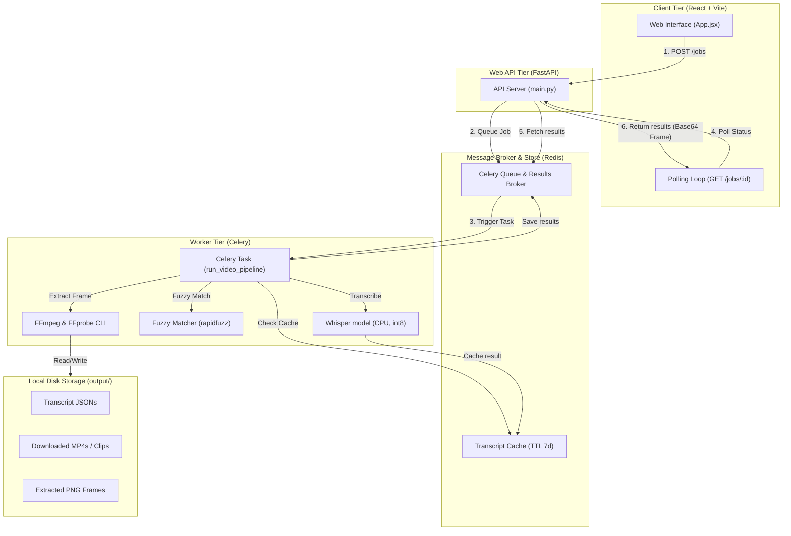

# Quest1 - Video Search & Frame Matcher
## Technical Design & Architecture Documentation

This document explains the architecture design, data flow, and pipeline stages of the Quest1 Video Search & Frame Matcher application.

---

## System Architecture

The application is structured as a decoupled, multi-tier system designed to handle heavy, asynchronous audio/video downloads and machine learning model inference (Whisper) without blocking user interactions.



### Component Details
1. **Client Tier**: A responsive SPA built with React and Vite. It communicates with the backend via REST, initiates search requests, displays status stages using a high-fidelity simulator, and renders the output (Base64 image, matched subtitle context, and timestamp).
2. **Web API Tier**: A FastAPI web server running under Uvicorn. It is responsible for lightweight endpoints:
   - `POST /jobs`: Receives client requests and queues background jobs into Celery.
   - `GET /jobs/{job_id}`: Queries the status (queued, processing, completed, or failed) of the job.
3. **Queue & Caching Tier (Redis)**: Performs dual duties:
   - **Celery Broker & Backend**: Routes task payloads and stores execution metadata and return values.
   - **Transcript Cache**: Houses serialized word-level timestamps mapped by video URL keys.
4. **Worker Tier**: An independent Celery worker daemon. This process runs the heavier workloads: downloading media files, hosting the `faster-whisper` ML model in memory, performing rapid fuzzy phrase lookups, and spawning FFmpeg/FFprobe subprocesses.
5. **Local Disk Storage**: Persists local transcriptions (as JSON files), target video source segments, and extracted frame files (`output/` folder).

---

## End-to-End Data Flow

The diagram below details the chronological sequences of operations from user submission to results rendering:

```mermaid
sequenceDiagram
    autonumber
    actor User
    participant FE as Frontend (React)
    participant BE as Backend (FastAPI)
    participant R as Redis (Queue & Cache)
    participant CW as Celery Worker
    participant Ext as External Video Host

    User ->> FE: Enter video URL & phrase
    FE ->> BE: POST /jobs {link, phrase}
    BE ->> R: Queue task (run_video_pipeline) & return Job ID
    BE -->> FE: 201 Created {job_id, status: queued}
    FE ->> FE: Start status polling loop & Stage progress simulation

    rect rgb(0, 0, 0)
        note right of CW: Background Worker Processing
        CW ->> R: Read task from queue
        CW ->> R: Query cached transcript for URL
        alt Cache Hit
            R -->> CW: Return word timings list
        else Cache Miss
            CW ->> Ext: Query video duration (yt-dlp)
            alt Video < 30 Minutes
                CW ->> Ext: Download full video (worst quality)
                CW ->> CW: Extract audio WAV using FFmpeg
            else Video >= 30 Minutes
                CW ->> Ext: Download audio WAV directly
            end
            CW ->> CW: Transcribe audio to word-level timestamps (faster-whisper)
            CW ->> R: Cache transcript list (7-day TTL)
            CW ->> CW: Save transcript JSON to output/
        end
        CW ->> CW: Run sliding window fuzzy match (rapidfuzz)
        CW ->> CW: Resolve overlapping matches
        alt Video exists locally
            CW ->> CW: Extract frame at matching timestamp using FFmpeg
        else Video not local (Audio only downloaded)
            CW ->> Ext: Download short video clip corresponding to matched phrase
            CW ->> CW: Extract frame from clip using FFmpeg
        end
        CW ->> R: Write task completion result (timestamp, base64 frame, text)
    end

    loop Every 2 seconds
        FE ->> BE: GET /jobs/{job_id}
        BE ->> R: Check Celery task state
        R -->> BE: Return state (PROCESSING or SUCCESS)
        BE -->> FE: Return job status (processing or completed + result)
    end
    FE ->> User: Render matched text, timestamp, and frame image
```



### Detailed Flow Explanation
1. **Submission Phase**:
   - The user inputs a URL and a search phrase.
   - The frontend dispatches a `POST` request to the backend.
   - FastAPI instantly submits the `run_video_pipeline` task to Redis and yields back a unique Job ID. This prevents request timeouts, keeping the UI interactive.
2. **Polling Phase**:
   - The React client initiates a `setInterval` loop, polling `GET /jobs/{job_id}` every 2 seconds.
3. **Execution Phase (Worker)**:
   - The Celery worker fetches the job payload from Redis.
   - The worker executes the modular data pipeline stages sequentially.
4. **Resolution & Completion**:
   - Once completed, the worker writes the final JSON result back to the Redis backend.
   - The next client polling request receives a `completed` status with the result payload.
   - The frontend stops polling and renders the matched phrase alongside the base64-encoded frame.

---

## Data Pipeline (Step-by-Step)

The data pipeline resides in [`pipeline.py`](file:///p:/projects/quest1/backend/src/pipeline.py) and operates sequentially on the input media:

```
[Input Link] ──> [Duration & Cache Check] ──> [Strategic Download] ──> [Whisper Transcribe] 
                                                                               │
[Output UI] <── [Base64 Frame Extract] <── [Overlap Resolution] <── [Fuzzy Matcher]
```

### Stage 1: Cached Transcripts Lookup
To optimize processing time and API limits, the worker first checks for pre-existing transcriptions:
- **Redis Check**: Looks up the key `transcript:{link}`.
- **Disk Check**: Looks up the local directory for `output/{clean_id}_trans.json`.
- If found, it bypasses downloading and transcription, skipping directly to **Stage 5**.

### Stage 2: Metadata & Duration Parsing
Using `yt-dlp`'s flat extraction mode, the pipeline queries the duration of the media file without downloading any byte payloads.

### Stage 3: Strategic Bandwidth Allocation (Download)
To conserve network resources and storage, the pipeline adopts a dual download policy:
- **Under 30 Minutes**: The full video is downloaded in `worst` video quality (highly efficient). Audio is then extracted locally using FFmpeg to a 16kHz WAV format.
- **Over 30 Minutes** (or unknown): Downloading a large video takes too long. Instead, the pipeline requests *only* the raw audio stream from the server, entirely omitting the video package.

### Stage 4: Whisper Transcription
The audio file is transcribed by `faster-whisper`:
- **Model Size**: Uses the `base` model.
- **Hardware Acceleration**: Runs on CPU configured with `int8` integer quantization for speed.
- **Timestamps**: Uses Whisper's word-level timestamps (`word_timestamps=True`) which provides `start` and `end` times for each individual spoken word.
- **Caching**: The generated array of `WordTiming` objects is immediately saved to the Redis cache (with a 7-day TTL) and serialized to `output/{clean_id}_trans.json` for future reuse.

### Stage 5: Fuzzy Phrase Matching
Standard exact string matching fails on transcripts due to homophones, typos, or translation variances.
- **Algorithm**: The matcher segments the transcript into a rolling sliding window corresponding to the target phrase word count (with a slack offset of $\pm 2$ words).
- **Matching Metric**: `rapidfuzz` calculates the `token_sort_ratio` between the sliding window's text and the user's phrase.
- **Threshold**: Candidates with similarity scores $\ge 80\%$ are retained.

### Stage 6: Overlap Resolution & Deduplication
If the target phrase is repeated, or if multiple window intervals match the same phrase, duplicate candidates overlap.
- **Resolution**: Overlapping candidates are grouped together by time. The candidate with the highest similarity score in each group is preserved, deduplicating the list.

### Stage 7: On-Demand Frame Extraction
Once the best timestamp is selected, the pipeline extracts the target frame:
- **Case A (Local Video Exists)**: If the video was downloaded locally in Stage 3, the pipeline uses FFmpeg to seek directly to the matching timestamp (`start_time + 1.0` seconds offset for context) and saves the frame.
- **Case B (Audio Only Exists)**: If only the audio was downloaded in Stage 3, the pipeline invokes `yt-dlp`'s clipping parameters to download a tiny video slice (usually just 5-10 seconds matching the phrase start and end times). FFmpeg then extracts the frame from this short clip using offset mapping.
- **Encoding**: The extracted frame file (`.png`) is read from disk, converted to a Base64-encoded string, and returned as the final payload.
